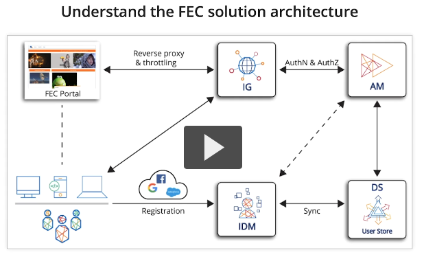

# ForgeRock Training

- [ForgeRock Training](#forgerock-training)
  - [INTRODUCTION MODULE](#introduction-module)
  - [ACCESS MANAGEMENT ESSENTIALS](#access-management-essentials)
  - [IDENTITY MANAGEMENT ESSENTIALS](#identity-management-essentials)
  - [DIRECTORY SERVICES ESSENTIALS](#directory-services-essentials)
  - [IDENTITY GATEWAY ESSENTIALS](#identity-gateway-essentials)

Training can be found at https://backstage.forgerock.com/university/cloud-learning

## INTRODUCTION MODULE

Intro video is the same in all 4 classes.
ForgeRock products are used to help secure internet facing services through authentication. They are meant to be as simple, frictionless, and as secure as possible.
3 different types of identities are being catered for by ForgeRock.
1. Consumers
2. Employees
3. Services / things

There are 4 parts to ForgeRock's solution.
1. Identity management
2. Access management
3. Universal storage directory
4. Identity governance

ForgeRock's trust network uses other vendor's tools in their solution. E.g. Google authentication. You can optionally use this.
Autonomous Identity engine can use existing identity stores (e.g. Active Directory) to expediate already authenticated users access to other systems.
ForgeRock uses Kubernetes for its cloud based solutions. This is optional.
The example company in the training is an online streaming service that charges customers for access. The architecture is pictured below.

Identity version 7 has the following new features that are useful for us:
* Better support for 'impersonate user'
* Seamless SSO for Windows using Kerberos
* Improved PKI authentication experience
* Improved WebAuthN experience
* Easier SAML administration via REST API or an administration UI
* The directory service was rewritten for k8s support but it is also easier to use in general.

ForgeRock supports using Docker and k8s for its containerised applications.
The Common Auditing Frameworks handles auditing for all products.
* It uses either JSON or CSV files.
* It is compatible with Splunk.
* Each audit event is given a unique transaction ID. Use this ID to follow the sequence of events of that activity, even across multiple audit logs (but you need to configure this option).

The new version uses Prometheus and Grafana for monitoring. You can view this stack below. Dashboards are already provided.

## ACCESS MANAGEMENT ESSENTIALS

Can be viewed at [forgerock-am-training-notes.md](forgerock-am-training-notes.md)

## IDENTITY MANAGEMENT ESSENTIALS

Can be viewed at [forgerock-im-training-notes.md](forgerock-im-training-notes.md)

## DIRECTORY SERVICES ESSENTIALS

Can be viewed at [forgerock-ds-training-notes.md](forgerock-ds-training-notes.md)

## IDENTITY GATEWAY ESSENTIALS

Can be viewed at [forgerock-ig-training-notes.md](forgerock-ig-training-notes.md)
