# ForgeRock Access Management

- [ForgeRock Access Management](#forgerock-access-management)
  - [1 - INTRODUCTION](#1---introduction)
  - [2 - INTRODUCING AM CORE CONCEPTS](#2---introducing-am-core-concepts)
  - [3 - PROTECTING AN APPLICATION WITH INTELLIGENT AUTHENTICATION](#3---protecting-an-application-with-intelligent-authentication)
  - [4 - CONTROLLING ACCESS TO AN APPLICATION WITH AM AUTHORIZATION](#4---controlling-access-to-an-application-with-am-authorization)
  - [5 - PROTECTING REST APIS AND INTEGRATING MOBILE APPLICATIONS WITH OAUTH2-BASED PROTOCOLS](#5---protecting-rest-apis-and-integrating-mobile-applications-with-oauth2-based-protocols)
  - [6 - IMPROVING SECURITY WITH A ZERO TRUST APPROACH](#6---improving-security-with-a-zero-trust-approach)
  - [7 - INTEGRATING WITH THIRD-PARTY SAML2 ENTITIES](#7---integrating-with-third-party-saml2-entities)

## 1 - INTRODUCTION

The introduction applies to all AM products, it can be viewed at [README.md](README.md#introduction-module)

## 2 - INTRODUCING AM CORE CONCEPTS

All access management solutions need to:
* Identify who the user is. This is called **Authentication**.
* Identify what the user is allowed to do. This is called **Authorization**.

The ForgeRock **Access Management (AM)** aims to provide:

* A great user experience by implementing a simple authentication mechanism for 1 to many services.
* An easy authentication journey for users, because they may need to reauthenticate later after the initial authentication.
* The ability to use multiple devices (e.g. mobile or laptop) for accessing the protected services.
* Various levels of authentication from simple username and password all the way up to multiple layers of authentication.
* The optional ability to leverage a user's existing third party authenticaion mechanisms (e.g. social media like Google and Facebook or in house **Active Diretory (AD)** so the user doesn't need another account.
* Giving context-aware **Single Sign On (SSO)** access. Some examples are:
  * The user's typicaly location.
  * The user's typical login times.
  * The user's typical device.
* Respecting user privacy and data.
* Using Zero Trust security model.
* Highly scalable and **high availability (HA)**.
  * If your authentication service is down then all other downstream services are down. This is one of the most critical pieces in your service architecture.

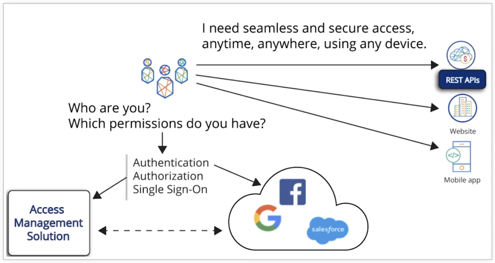

ForgeRock AM can talk to external systems via the user's browser via **Open Authorization 2.0 (OAuth2)**, **OpenID Connect (OIDC)**, or **Security Assertion Markup Language 2.0 (SAML2)** to utilise a user's existing third party authenticaion mechanisms like their social media account.

ForgeRock AM can use the following for authentication:
* **ForgeRock Identity Gateway (IG)** can be a reverse proxy handling authentication between the user and the requested resource.
  * This can be used to replace a legacy application's authentication method.
* Java agents for Java apps.
* Web agents for websites.
* Identity Edge Controller for **Internet of Things (IoT)** devices.
* Various **software development kits (SDKs)** can be leveraged to provide authentication. E.g. Android or IOS SDKs for mobile devices or JavaScript SDK for a JavaScript webapp running in the browser.

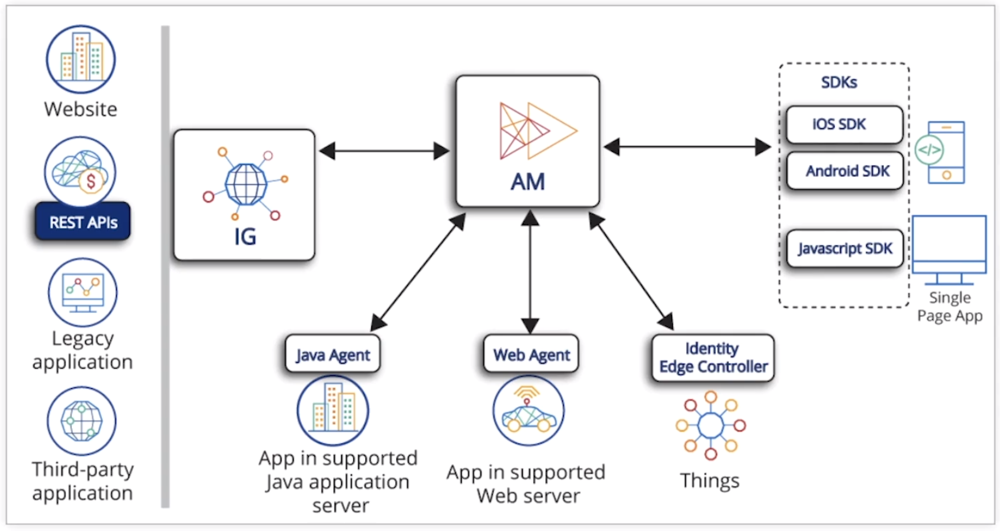

The traditional problem of webapps was once a user authenticated the authentication was lost on the serverside. This was solved by:
* A serverside object called a session is used to keep a user's authentication state persistant.
* A clientside object stores the session information, typically in a cookie or local storage.

The stored session data is used in every request to prove that user still authenticated. A user is no longer considered authenitcated when the session times out or the user logs out and ends the session.

ForgeRock AM can utilise the session approach to keep users authenticated and provide a simple user experience. It can do this via logging in directly to AM or using an existing session from an external source (e.g. Active Directory or Google).

The problem with this session approach is that a user needs session information for every service they are accessing. Without an AM tool, they will need to sign in to each service individually. This is a poor user experience. SSO fixes this problem by having a user sign into an AM tool once, and the session from the AM tool is used to sign into all the services is it linked to. So from the user perspective they only have to sign in once and can access multiple services.

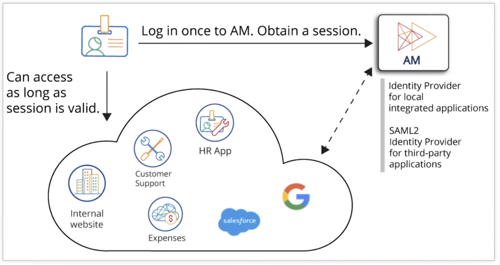

**Multi-Factor Authentication (MFA)** is an optional use case, multiple MFA approaches are supported. This could be a one time password or code, an external authenticator app, etc.

Personalisation can be applied after a user logins and is stored in the user profile, typically stored in the **ForgeRock Directory Server (DS)**.

When attempting to access an application gated by ForgeRock AM, a redirect from the application to ForgeRock AM is made and the authentication is attempted. If successful, the user is redirected back to the application and is authenticated within it.

`IPlanetDirectoryPro` cookie is the most important clientside cookie as it has the authentication session from ForgeRock AM. This cookie is always sent to ForgeRock AM with each request so ForgeRock AM knows the user is still authenticated. ForgeRock AM will check to see if that session is still valid. This approach is useful when you have full control of the network and want SSO, but isn't desireable for internet facing applications. When you don't have control of the network use another approach like OAuth2 or OIDC.

OAuth2 or OIDC is used instead for SSO with internet facing applications. The `IPlanetDirectoryPro` cookie is held in the `am-auth-jwt` cookie. The cookie contents could be decoded in a JWT application, you can encrypt it to protect against this. This cookie is not sent to ForgeRock AM and cannot be set by ForgeRock AM, so it must be set by the application itself. A web policy agent is typically used to set this cookie.

## 3 - PROTECTING AN APPLICATION WITH INTELLIGENT AUTHENTICATION

When a user wants to access a resource that is gated by ForgeRock IG, the ForgeRock web agent, or ForgeRock Java agent, their request is intercepted and forwarded to log into ForgeRock AM so they can be authenticated. The credentials provided by the user to FR AM could be:
* Username and password,
* One time code or password,
* Tapping a button on a mobile device,
* Biometric, etc.

Once the user is authenticated an SSO token is returned by FR AM through the browser of the user or the application itself. The SSO token could be:
* A clientside session cookie from a web policy agent,
* A SAML assertion,
* An OIDC token, etc.

The returned SSO token is used to authenticate the user and allow access to the resource from the initial request. The user is only authenticated if the SSO token can be validated. There are many ways to validate an SSO token.

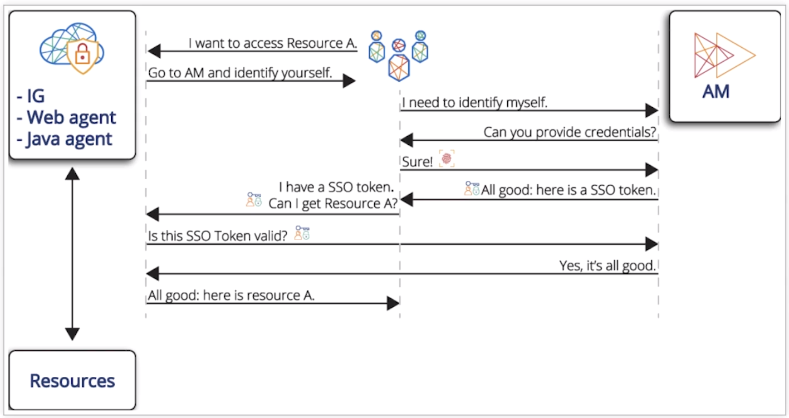

FR AM can cater for a variety of identity entities, the main ones are:
* **Workforce** - this is used for the organisation's employees on a trusted internal network. This is used to handle typical employee use cases like SSO.
* **Customers** - this is used for the organisation's customers on the internet, an untrusted network. This is used to handle typical customer use cases like needing high scalabilty for high demand.
* **Things** - this is used for IoT devices which needs to use authentication methods that aren't username and password based.

FR AM can be configured to:
* Allow a user to chose what type of authentication to use.
* Allow multiple types of authentication, e.g. an easy authentication path for a user's known device but then escalate to a harder authentication path when the user uses a an unknown device.
* Configure different authentication paths for different applications.

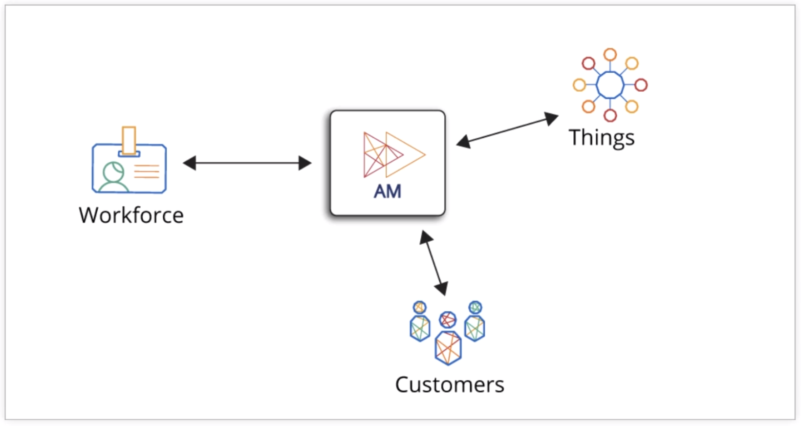

FR AM uses **Authentication Trees** filled with **Authentication Nodes** to create the authentication pathway. Each Authentication Node represents a single task and it contains the logic to perform the task it represents. Authenitcation Trees usually start with a Start node and finish with either a Success or Failure node. You can write your own Authenitcation Nodes with Java or using scripting.

In the example below the enter credentials node is asking for the username and password on the same page, but you could separate this across multiple pages.

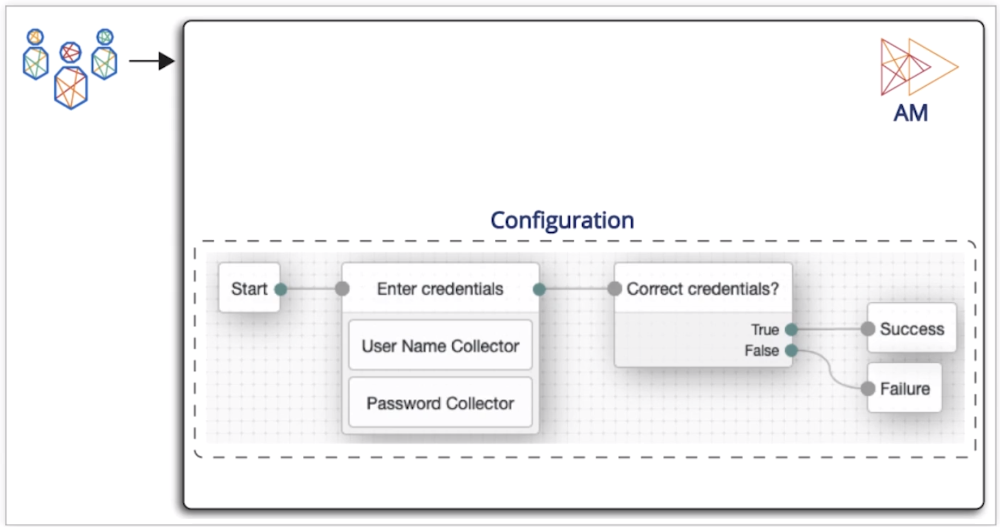

FR AM authentication trees can have a variety of configurations, such as loops, branching, and decisions via user input. In the example below:
* Looping is used to allow the user to try their password up to the 3 failures.
* A user chooses which MFA method to use.
* Branching is used to control the execution flow after the user's MFA choice.

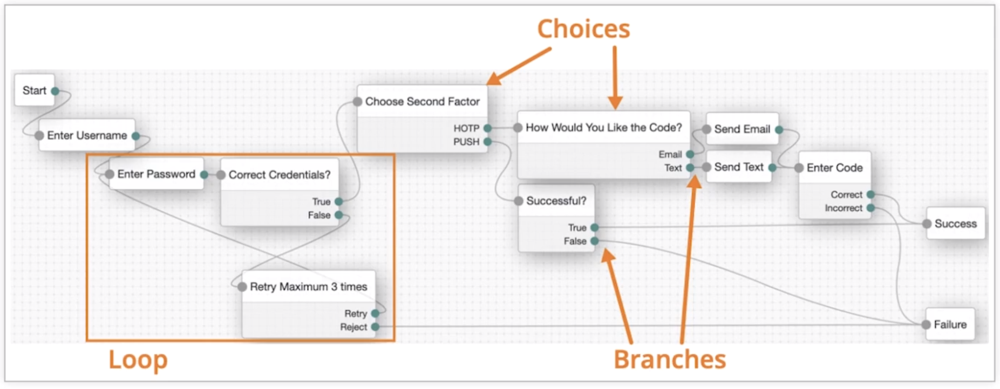

There is a drag and drop GUI called the **Tree Designer** which you can use to created authentication trees. The authentication nodes are grouped in topics on the left hand side of the GUI.

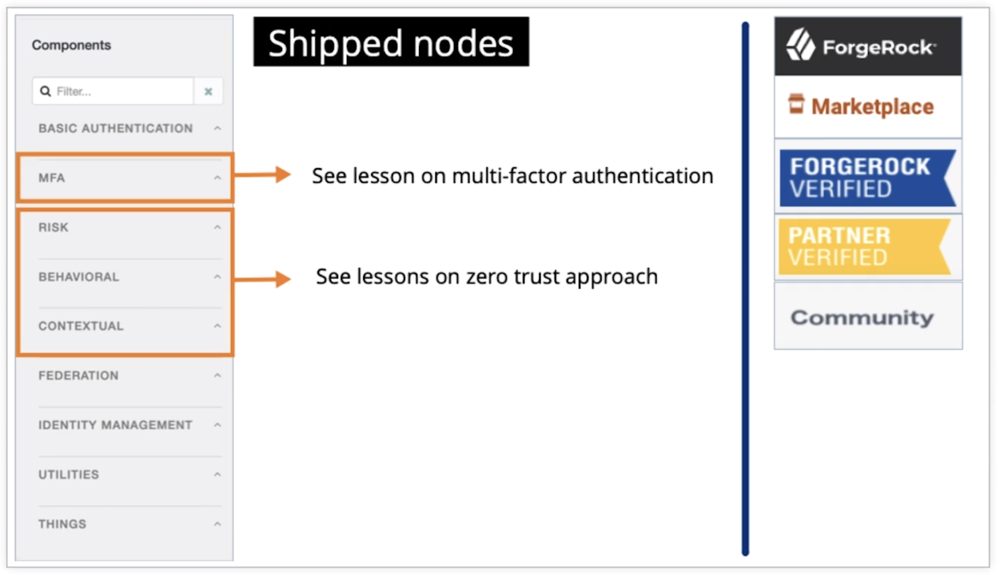

FR AM can allow users to register themselves and FR AM will send a REST API request to **ForgeRock Identity Manager (IM)** which will provision the user. This is why Identity Management is within the Tree Designer GUI.

There are plenty of different authentication nodes:
* The Zero Page Login Collector nodes checks  the username and password supplied in the HTTP header fields.
* The LDAP Decision node can be used to authenticate against an LDAP or Active Directory server.
* There is a variety of social media authentication nodes (e.g. Google and Facebook)
* There is a SAML authentication node to delegate to another service for SAML authentication.
* Terms & Conditions Decision node forces a user to accept terms and condition and store that in their profile.

You can:

* Add Timer nodes to your authentication tree flows to store how long it takes for users to log in. This can be used later for decision making (e.g. an attack bot is trying to log in quicker than the user normally does)
* Ask a user to confirm their email address via the authentication tree flow.
* Use many more nodes not described here.

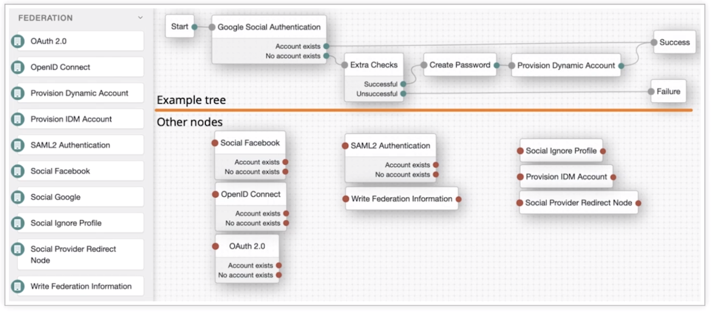

Click on an authenication tree object to see its configuration options.

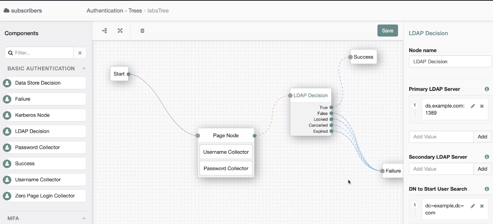

You can nest trees by using the Inner Tree Evaluator.

FR AM supports MFA, which is requiring the user to supply 2 or more different forms of credentials. The typical set up is providing a username and password for the HTTPS connection and then providing a timed based password **one time password (OTP)** from an authenitcator app (e.g. Authy has a numeric token updating every minute that is synced with the app).

MFA can be requested by FR AM all the time, or only when user privilege escalation is required, or a new device is being used by the user, or other scenarios.

ForgeRock supply an MFA authenticator app that can be rebranded with your organisation's logos and integratable with your applications. The OTPs are supplied using **hash-based message authentication codes (HMAC)**. There are 3 approaches (https://crypto.stackexchange.com/a/205) and each have pros and cons:

1. **Encrypt-then-MAC** = Encrypt the plaintext, MAC the ciphertext + IV, and then append it to the ciphertext. *This is typically used.*
2. **MAC-then-Encrypt** = MAC the plaintext then append the MAC to the plaintext then encrypt it all.
3. **Encrypt-and-MAC** = Encrypt and MAC the plaintext then append the MAC onto the ciphertext.

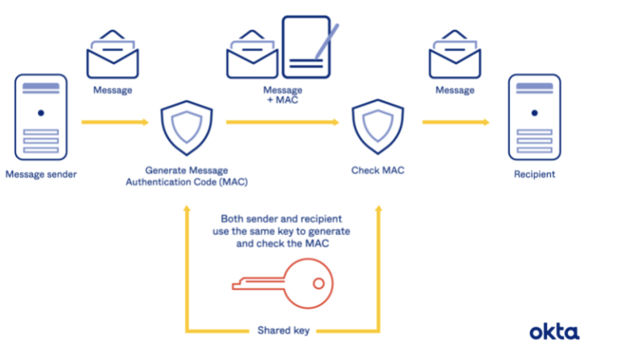

FR AM uses a service to implement pushing OTPs and other authentcation methods to registered user devices. The user must register their device.

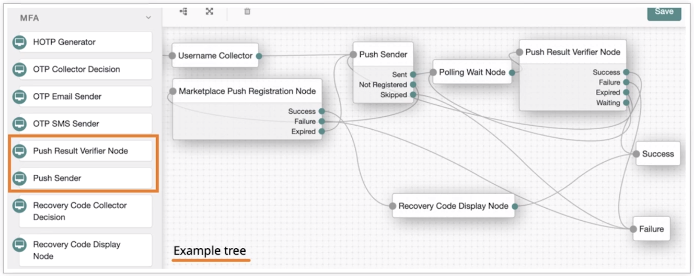

**Web authentication (WebAuthn)** outservices authentication to an external services (e.g. Yubikey) via the WebAuthn standard.

Users will not directly log into FR AM, they will try to log into an application which will forward them to the FR AM and the correct authentication tree. You can configure FR AM to only allow specific authentication trees for an application.

## 4 - CONTROLLING ACCESS TO AN APPLICATION WITH AM AUTHORIZATION

AM entitlement management (i.e authorisation) dictates:
* **Who** can...
  * Subject
* **Do** something...
  * Action
* To **something**...
  * Resource
* With specific **constraints**.
  * Conditions

The above is the basic premise of **attribute based access control (ABAC)** and **role based access control (RBAC)**. [ABAC v RBAC](https://www.okta.com/au/identity-101/role-based-access-control-vs-attribute-based-access-control/)

FR AM has a typical work flow.
* A user tries to access a resource. The user may or may not already be authenticated.
* The user's request is intercepted by a **policy enforcement point (PEP)**
* The PEP forwards the user's request onto a **policy decision point (PDP)**
* The PDP performs user authorisation and returns the result.

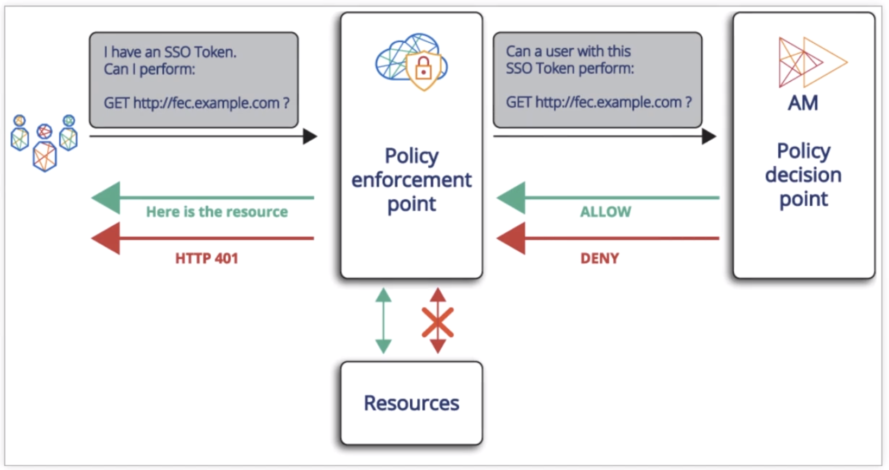

## 5 - PROTECTING REST APIS AND INTEGRATING MOBILE APPLICATIONS WITH OAUTH2-BASED PROTOCOLS

TODO

## 6 - IMPROVING SECURITY WITH A ZERO TRUST APPROACH

TODO

## 7 - INTEGRATING WITH THIRD-PARTY SAML2 ENTITIES

TODO