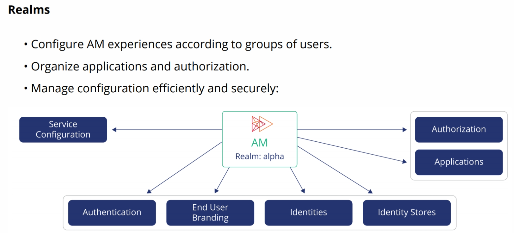
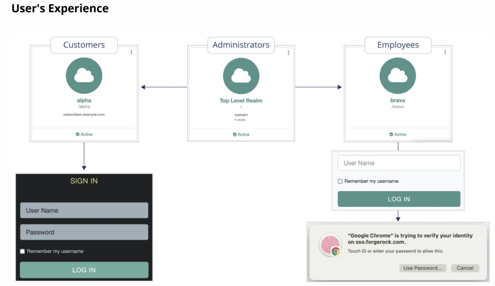
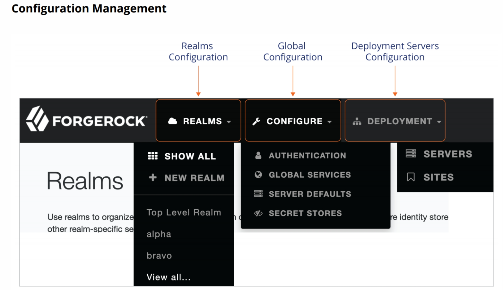
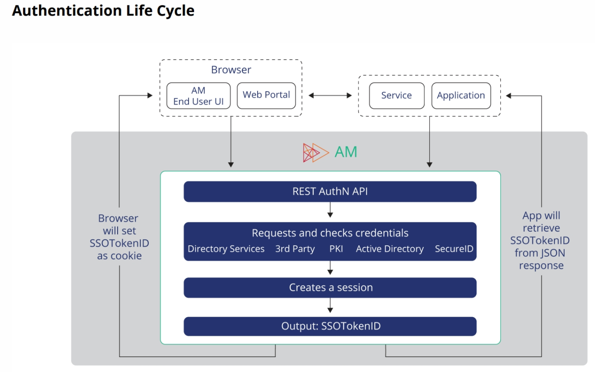
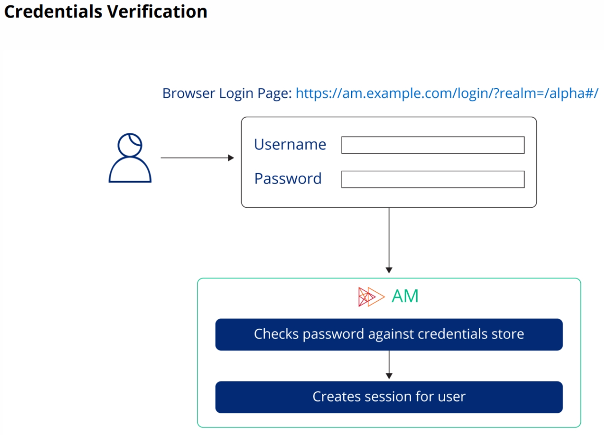
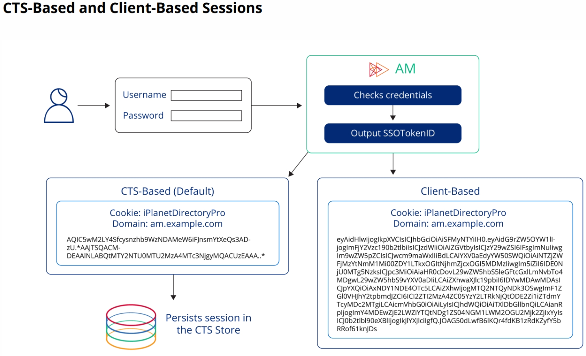

# AM410 Day 1 - Enhancing Intelligent Access

- [AM410 Day 1 - Enhancing Intelligent Access](#am410-day-1---enhancing-intelligent-access)
  - [Lab Environment Setup](#lab-environment-setup)
  - [Lesson 1 - Exploring Authentication Mechanisms](#lesson-1---exploring-authentication-mechanisms)
    - [Authentcation & Authorization](#authentcation--authorization)
    - [Realms](#realms)
    - [Authentication Lifecycle](#authentication-lifecycle)
    - [Intelligent Authentication](#intelligent-authentication)
  - [Lesson 2 - Protecting A Website With IG](#lesson-2---protecting-a-website-with-ig)
  - [Lesson 3 - Controlling Access](#lesson-3---controlling-access)

## Lab Environment Setup

Task 1: Examine the AM installation inside of Student workbook > page 17

The VM is available on the internet.

## Lesson 1 - Exploring Authentication Mechanisms

###  Authentcation & Authorization

Businesses offer services and resources to their users. Businesses typically use identity & access management (IdAM) tools to gate access to their services and resources. All access management tools need to:
* Identify who the user is. This is called **Authentication**.
* Identify what the user is allowed to do. This is called **Authorization**.

The **ForgeRock Access Management (FR AM)** tool provides authentication and authorisation. Once a user has successfully authenticated, FR AM maintains information about that user's session a server-side in a structure called an `SSOToken`. Users need to be authenticated to FR AM before they can access any services gated by FR AM.

AM services are written in Java. The layers in this image are:

1. The Protected resources users are trying to access.
2. REST API layer. This is exposed to the world to provide a common way to access FR AM resources. e.g. request user information.
3. AM core services. e.g. authentication and session managment.
4. Persistent storage for FR AM configuration, identities, policies, applications, sessions. e.g. sessions are stored in the **Core Token Service (CTS)** LDAP.

### Realms

Realms are used for various purposes:
* Configuring different AM experiences for different groups of users.
* Organise protected applications, their authorization, and their configuration.

Realms can configure:
* Authentication
* End user branding
* Identities (users, groups, and privileges)
* Identity stores
* Service configuration
* Authorization
* Applications (policy agents, OAuth 2.0 (OAuth2) clients, and federation)

Top Level Realm:
* Is the default realm created when AM is installed.
* Should be used by FR AM admins only.
* It is also known as `/` or `root` Realm.

Subrealms:
* Should always be created for other use cases rather than using the Top Level Realm.
  * A single subrealm is appropriate if the user population is a single community and requires a uniform FR AM experience.
  * Multiple subrealms are appropriate is the user population isn't a single community and requires a different FR AM experience per community.
* Application owners can have access to their Subrealm through the FR AM UI to be able to configure it.

The top level in the UI is for global configuration and the left side panel is for the currently selected Realm.

Use the `realm` URL parameter to access the authentication interface, e.g. [https://am.example.com:9443/login/XUI/?realm=/alpha#login](https://am.example.com:9443/login/XUI/?realm=/alpha#login) would log into the alpha Realm. You could make a better user experience by using a DNS alias for this URL, e.g. [https://subscribers.example.com:9443/login/XUI/#login](https://subscribers.example.com:9443/login/XUI/#login) would redirect the user to the correct page. This can be done in Realm configuration (e.g. click edit on the Realm in the Dashboard).

### Authentication Lifecycle

FR AM authentication is done through a series of REST API calls by users to the AM services. When a user logs in a user session is created. The session holds information about the user that just authenticated and about the authentication process itself. The session is present in the server memory for some time and is persisted in the CTS store. The CTS store is a **ForgeRock Directory Services (FR DS)** instance that holds various type of tokens, such as SSO tokens, OAuth2 tokens, and SAML2-related data. An embeded FR DS is installed by default with FR AM.

The `SSOToken` is a unique ID that stores a user session and is used by all AM systems. An `SSOTokenID` is given to the client. The `SSOTokenID` is either set as a cookie when using a browser, returned to the service in case of a REST call, or included in a JSON Web Token (JWT) when using **ForgeRock Identity Gateway (FR IG)** or a web agent.

`IPlanetDirectoryPro` cookie is the most important clientside cookie as it has the authentication session from ForgeRock AM. This cookie is always sent to ForgeRock AM with each request so ForgeRock AM knows the user is still authenticated. ForgeRock AM will check to see if that session is still valid. This approach is useful when you have full control of the network and want SSO, but isn't desireable for internet facing applications. When you don't have control of the network use another approach like OAuth2 or OIDC.

Users accessing AM for the first time do not have an existing session and are called unauthenticated users. They will be required to authenticate with AM before being able to access resources. Users reach the AM login page because another portal or application sends them there.

Typically, users are redirected back to where they came from. In order to do so, the portal or application can use the `goto` URL parameter. AM requires that all goto redirection URLs are whitelisted in the access management Validation Service for the Realm.

Authenticated sessions:
* Represent an interactive exchange between AM and an identity.
* Created after successful authentication.
* Persisted in the CTS store, by default.
* Referenced using a unique `SSOTokenID` value.
* Contain internal and custom properties.
* Have idle timeout and maximum lifetime.
* Invalidated by timeout (idle or lifetime), active logout from the user, and administrative invalidation.

Authentication sessions:
* Keep track of the state during authentication.
* Have a limited lifetime which is the authentication process, up to a maximum of 2 minutes. This is stored in the `amlbcookie`.

Authenticated sessions:
* Are the result of a successful authentication.
* Have a default lifetime of 120 minutes. This is the maxium length and this timeout can be set globally, per Realm, or per user.

A session contains information to make access management decisions, such as the user's identity, authentication method, remaining session time, and the authentication realm. The idle timeout is determined by the REST calls made by the application.

After authentication and AM creates a session, AM needs to communicate a reference about the session to any party that may need it, such as IG, web agents, and applications.

Where no browser is involved, AM returns the `SSOTokenID` directly; for example, as a JSON Response to a REST call. When a browser is used, the browser is instructed to set a cookie. The cookie name is` iPlanetDirectoryPro` by default. You should change the default cookie name for production environments.

AM can be configured to use one of the following two methods to keep track of the session:
* A CTS-based session, which is stored in FR DS and is the default approach.
* A client-based session, which is stored in a user's browser using JWT token. You could decode this is https://jwt.io but remember JWT's start with `ey` so delete anything before `ey`.

By default the session cookie has the scope of a domain name. So in the brower's developer tools your session cookie is not displayed when the browser accesses another domain, because the cookie is configured as a domain-based cookie that is visible to the domain from which it was sent, and subdomains of the cookie domain. Once you return the previous domain your session cookie will be accessible again. When logging out the cookie is removed.

By obtaining the session cookie value, anyone can gain access to the user's session. For that reason, all communication with AM must use SSL/TLS.

When a cookie is set in the browser and the user returns to the AM login page, AM can read the cookie and validate it. If the validation is successful, AM can proceed with the flow. Otherwise, AM considers that the user is not authenticated and displays the login page again.

Once authentication is successful, the end user may end up on different pages, depending on the context.

Note that changing the Default Success Login URL or the Default Failure Login URL values requires the new URL values to be added to the Validation Service whitelist.

An end user, however, only has access to their user profile page and self-service areas, if configured. Note that a user account may be granted full administrative privileges. If that is the case, the user would then have access to both the AM Admin UI and the user's profile page and self-service areas.

When you are logged into a Realm and try to access aother Realm that you are not logged into, you will see the page `LEAVING SITE`, also called the switchRealm page (check the fragment name in the URL). It is a page displayed when a user is already authenticated to a realm and tries to access another one. This demonstrates that a user can only be logged in to one realm at a time.

### Intelligent Authentication

## Lesson 2 - Protecting A Website With IG

## Lesson 3 - Controlling Access

