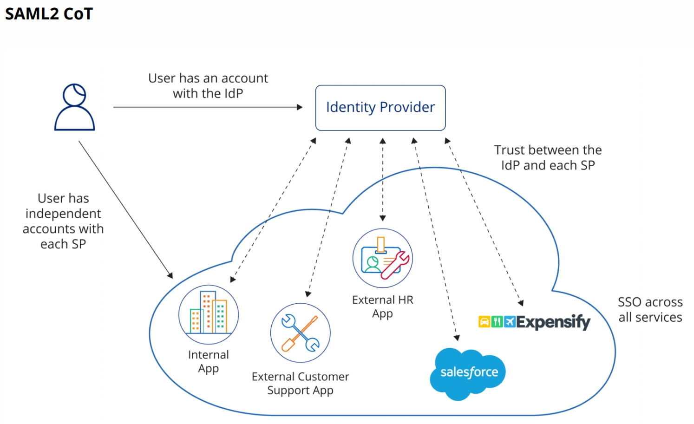
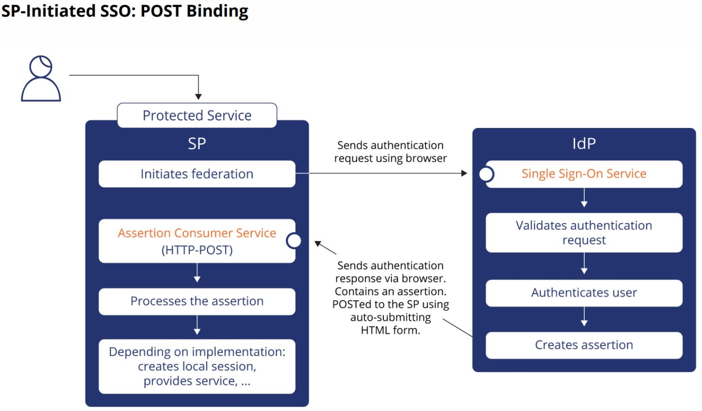
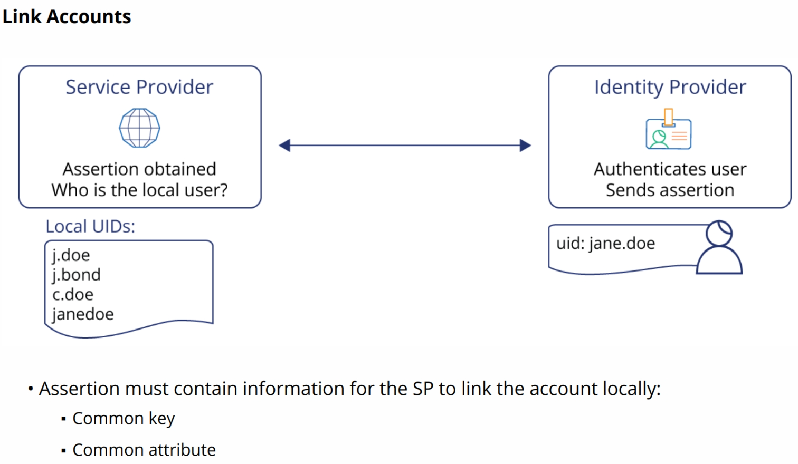
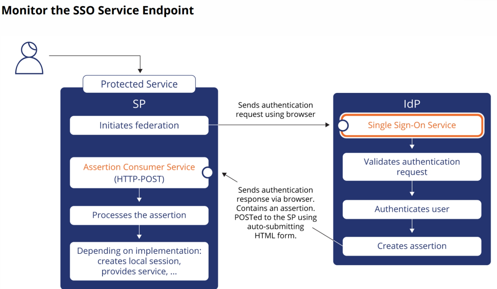
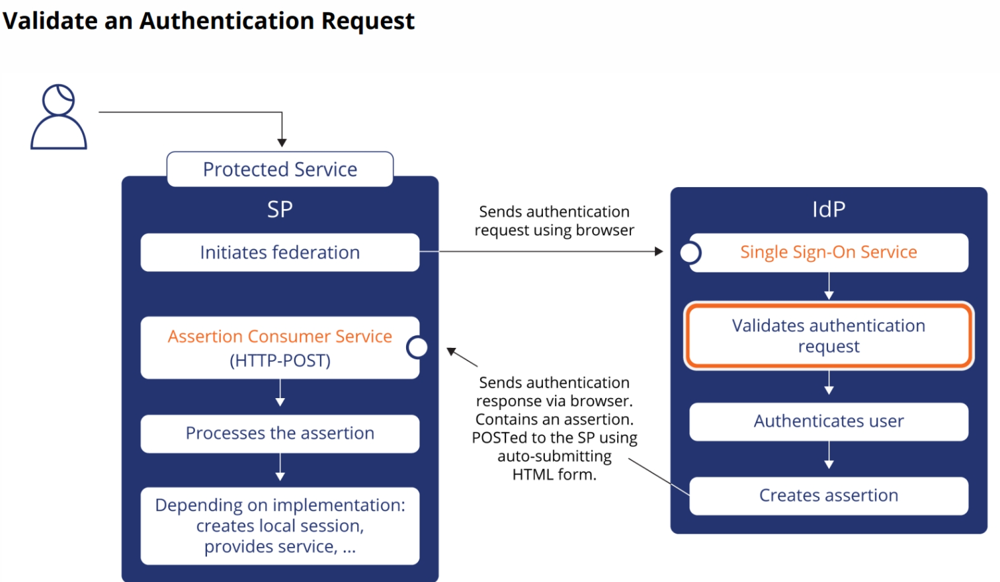
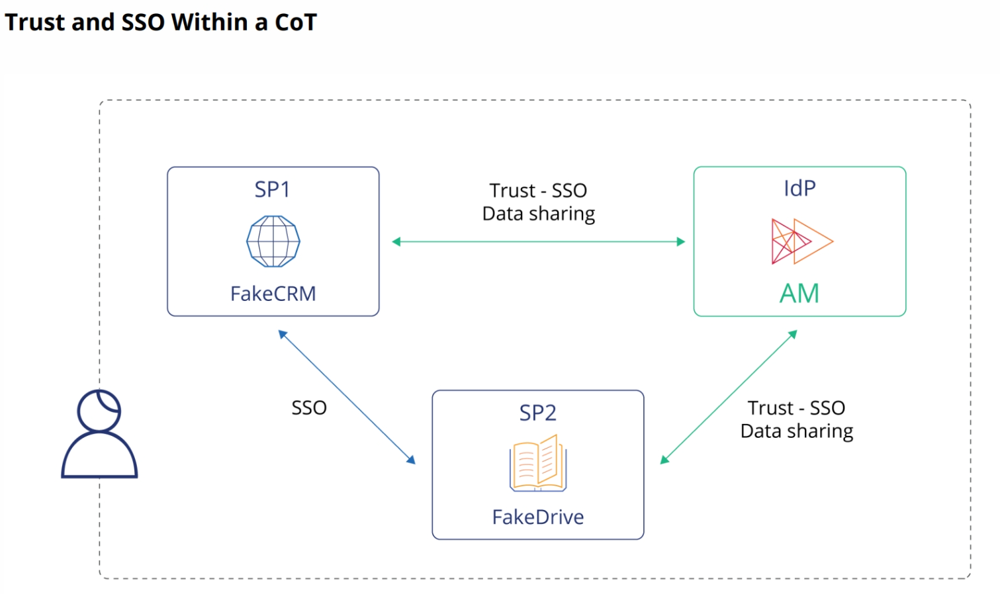
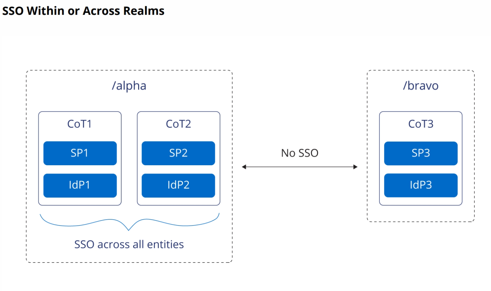

# AM410 Day 4 - Federating Across Entities Using SAML2

- [AM410 Day 4 - Federating Across Entities Using SAML2](#am410-day-4---federating-across-entities-using-saml2)
  - [Lesson 1 - Implementing SSO Using SAML2](#lesson-1---implementing-sso-using-saml2)
    - [Okta & Duo SAML Explanation](#okta--duo-saml-explanation)
    - [Overview](#overview)
    - [Labs](#labs)
  - [Lesson 2 - Delegating Authentication Using SAML2](#lesson-2---delegating-authentication-using-saml2)
    - [Labs](#labs-1)

## Lesson 1 - Implementing SSO Using SAML2

### Okta & Duo SAML Explanation

https://support.okta.com/help/s/article/Beginners-Guide-to-SAML?language=en_US

https://duo.com/blog/the-beer-drinkers-guide-to-saml

**SAML (Security Assertion Markup Language)** is an XML-based standard for exchanging authentication and authorization data between an identity provider (IdP) such as Okta, and a service provider (SP) such as Box, Salesforce, G Suite, Workday, etc, allowing for a **Single Sign-On (SSO)** experience.
* **Identity Provider (IdP)** is the software tool or service that performs the authentication; checking usernames and passwords, verifying account status, invoking two-factor, etc. This is often visualized by a login page and/or dashboard.
* **Service Provider (SP)** is the web application where user is trying to gain access.
* **SAML Assertion** is a message asserting a user’s identity and often other attributes, sent over HTTP via browser redirects.
* **Federating identities** is a common practice where user identities are stored across disparate applications and organizations. SAML allows these federated apps and organizations to communicate and trust one another’s users.

SAML provides a way to authenticate users to SP provided third-party web apps (e.g. Gmail for Business, Office 365, etc.) by redirecting the user’s browser to a company login page. Then after successful authentication on that login page, redirecting the user’s browser back to that third-party web app where they are granted access. **The key to SAML is browser redirects!**

SAML is the common underlying protocol that makes web-based SSO possible. A company maintains a single login page, single or multiple identity stores, and various authentication rules. Then they can easily configure any web app that supports SAML to allow their users to log in all web apps from the same login screen with a single password. It also has the security benefit of neither forcing users to maintain and potentially reuse passwords for every web app they need access to, nor exposing passwords to those web apps.

1. Bob walks to the Wristband Tent, where his ID is checked and a wristband is provided.
   1. The Wristband Tent is the IdP, it verifies Bob's identity to make sure he meets the criteria to get a wristband.
2. Bob walks over the Beer Tent and uses his wirstband to get a beer.
   1. The Beer Teen is the SP, it provides the service that Bob wants.

There are two different sign-in flows for which authentication can be handled by SAML:
1. SP-initiated flow.
2. IdP-initiated flow.

SP-initiated flow occurs when the user first navigates to the SP, getting redirected to the IdP with a SAML request, and then redirected back to the SP with a SAML assertion.

IdP-initiated flow occurs when the user first navigates to the IdP (typically a login page or dashboard), and then going to the SP with a SAML assertion.

**Note:** **SAML Tracer**, a free add-on available for Firefox, is an extremely useful tool in helping understand and troubleshoot SAML assertions. It allows you to extrapolate SAML assertions from your browsing session and examine them line-by-line.

### Overview

* Standard for exchanging data between organizations and across security domains.
* XML-based protocol.
* Uses assertions to pass information:
  * About a principal (usually an end user)
  * From an Identity Provider (holds the identities, manages authentication)
  * To a Service Provider (protects and provides a service)
* AM can be configured as an IdP or an SP.

SPs and IdPs participating in a federation need a common understanding about:
* **Circle of Trust (CoT)**: The entities that are part of the system.
* Metadata: Configuration parameters of the participating entities.
* SAML2 protocol objects:
  * Requests, responses, and assertions
  * Facilitate communication at runtime

The CoT is a group of federated entities, normally the federation partners, who have come together to form a trusted federation. Entities in the federation share security and connection information with each other, and create a trust relationship by which they can exchange and utilize federated identity information between them.

SP-initiated means that the federation is initiated and controlled by the SP.

1. User tries to access a service.
2. SP sends a SAML2 authentication request.
3. IdP processes the request and authenticates the user.
4. IdP creates an assertion.
5. IdP sends a SAML2 response containing an assertion to the SP.
6. SP processes the response.
7. SP proceeds with the flow.

**Artifact binding** defines the way the assertion created by the IdP is transmitted to the SP. It ensures that the assertion is never exposed to the client; the client is given an artifact (a unique semi-random number) that can be used by the SP to retrieve the assertion from the IdP. The artifact binding does require that the SP can reach the IdP directly. It uses Simple Object Access Protocol (SOAP) to communicate with the IdP.

IdP-initiated means that the federation is initiated and controlled by the IdP.

The process of associating the IdP and SP accounts correctly is called **linking accounts.** To be able to perform account linking, something must be present in the assertion in order to link the authenticated user with a local account on the SP. That can take two forms:
1. Common key, a common key is used to link the accounts.
   1. Must be established before federation can take place:
      1. Out-of-band (Microsoft requirement for Azure integration).
      2. Established during first access.
      3. Requires user to log in to both IdP and SP.
2. Common attribute, a common attribute is used to link the accounts, e.g. an email address.
   1. Requires user to log in to IdP only.
   2. Called auto-federation.

* AM as an IdP is called the hosted IdP.
  * Monitoring the SSO service endpoint.
  * Validating authentication request.
  * Authenticating end user.
  * Creating an assertion.
  * Sending the response.
* Third-party SP is called remote SP.

The IdP can return profile attributes of the principal. It checks its configuration to find out which attributes need to be returned. That process is governed by the IdP attribute mapper.

Trust and SSO are two separate concepts. In SAML2, trust is established between an SP and an IdP. This trust relationship allows things such as data sharing. There is no trust relationship across SPs, but there is SSO functionality for all of them.

Entities within the same realm are able to use SSO even if they belong to separate CoTs.

### Labs

## Lesson 2 - Delegating Authentication Using SAML2

###

### Labs
