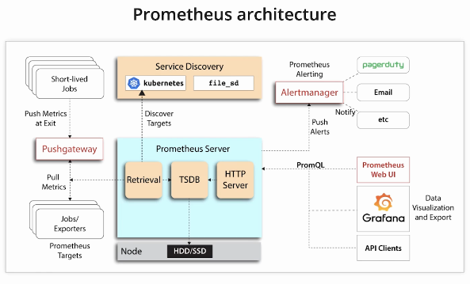
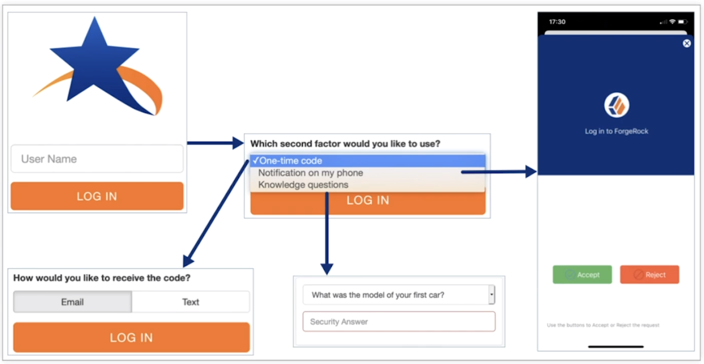
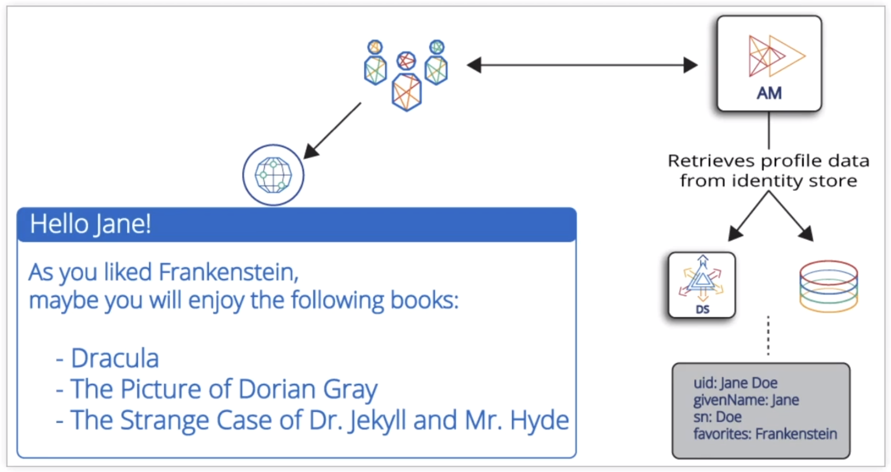

# ForgeRock Training

- [ForgeRock Training](#forgerock-training)
  - [ALL](#all)
    - [INTRODUCTION MODULE](#introduction-module)
  - [ACCESS MANAGEMENT ESSENTIALS](#access-management-essentials)
    - [1 - INTRODUCING AM CORE CONCEPTS](#1---introducing-am-core-concepts)
    - [2 - PROTECTING AN APPLICATION WITH INTELLIGENT AUTHENTICATION](#2---protecting-an-application-with-intelligent-authentication)
    - [3 - CONTROLLING ACCESS TO AN APPLICATION WITH AM AUTHORIZATION](#3---controlling-access-to-an-application-with-am-authorization)
    - [4 - PROTECTING REST APIS AND INTEGRATING MOBILE APPLICATIONS WITH OAUTH2-BASED PROTOCOLS](#4---protecting-rest-apis-and-integrating-mobile-applications-with-oauth2-based-protocols)
  - [Identity Management Essentials](#identity-management-essentials)
  - [Directory Services Essentials](#directory-services-essentials)
  - [Identity Gateway Essentials](#identity-gateway-essentials)

## ALL

### INTRODUCTION MODULE

Intro video is the same in all 4 classes.
ForgeRock products are used to help secure internet facing services through authenticaiton. They are meant to be as simple, frictionless, and as secure as possible.
3 different types of identities are being catered for this ForgeRock.
1. Consumers
2. Employees
3. Services / things

There are 4 parts to ForgeRock's solution.
1. Identity management
2. Access management
3. Universal storage directory
4. Identity governance

ForgeRock's trust network uses other vendor's tools in their solution. E.g. Google authentication. You can optionally use this.
Autonomous Identity engine can use existing identity stores (e.g. Active Directory) to expediate already authenticated users access to other systems.
ForgeRock uses Kubernetes for its cloud based solutions. This is optional.
The example company in the training is an online streaming service that charges customers for access. The architecture is pictured below.

Identity version 7 has the following new features that are useful for us:
* Better support for 'impersonate user'
* Seamless SSO for Windows using Kerberos
* Improved PKI authentication experience
* Improved WebAuthN experience
* Easier SAML administration via REST API or an administration UI
* The directory service was rewritten for k8s support but it is also easier to use in general.

ForgeRock supports using Docker and k8s for its containerised applications.
The Common Auditing Frameworks handles auditing for all products.
* It uses either JSON or CSV files.
* It is compatible with Splunk.
* Each audit event is given a unique transaction ID. Use this ID to follow the sequence of events of that activity, even across multiple audit logs (but you need to configure this option).

The new version uses Prometheus and Grafana for monitoring. You can view this stack below. Dashboards are already provided.

## ACCESS MANAGEMENT ESSENTIALS

### 1 - INTRODUCING AM CORE CONCEPTS

All access management solutions need to:
* Identify who the user is. This is called **Authentication**.
* Identify what the user is allowed to do. This is called **Authorization**.

The ForgeRock **Access Management (AM)** aims to provide:

* A great user experience by implementing a simple authentication mechanism for 1 to many services.
* An easy authentication journey for users, because they may need to reauthenticate later after the initial authentication.
* The ability to use multiple devices (e.g. mobile or laptop) for accessing the protected services.
* Various levels of authentication from simple username and password all the way up to multiple layers of authentication.
* The optional ability to leverage a user's existing third party authenticaion mechanisms (e.g. social media like Google and Facebook or in house **Active Diretory (AD)**) so the user doesn't need another account.
* Giving context-aware **Single Sign On (SSO)** access. Some examples are:
  * The user's typicaly location.
  * The user's typical login times.
  * The user's typical device.
* Respecting user privacy and data.
* Using Zero Trust security model.
* Highly scalable and highly availability.
  * If your authentication service is done then all other downstream services are down. This is one of the most critical pieces in your service architecture.

ForgeRock AM can talk to external systems via the user's browser via OAuth2, **OpenID Connect (OIDC)**, or SAML2 to utilise a user's existing third party authenticaion mechanisms like their social media account.

ForgeRock AM can use the following for authentication:
* Identity Gateway can be a reverse proxy handling authentication between the user and the requested resource.
  * This can be used to replace a legacy application's authentication method.
* Java agents for Java apps.
* Web agents for websites.
* Identity Edge Controller for IoT devices.
* Various SDKs can be leveraged to provide authentication (e.g. Android or IOS SDKs for mobile devices or JavaScript SDK for a JavaScript webapp running in the browser)

The traditional problem of webapps was once a user authenticated the authentication was lost on the serverside. This was solved by:
* A serverside object called a session is used to keep a user's authentication state persistant.
* A clientside object stores the session information, typically in a cookie or local storage.

The stored session data is used in every request to prove that user still authenticated. A user is no longer considered authenitcated when the session times out or the user logs out and ends the session.

ForgeRock AM can utilise the session approach to keep users authenticated and provide a simple user experience. It can do this via logging in directly to AM or using an existing session from an external source (e.g. Active Directory or Google).

The problem with this session approach is that a user needs session information for every service they are accessing. Without an AM tool, they will need to sign in to each service individually. This is a poor user experience. SSO fixes this problem by having a user sign into an AM tool once, and the session from the AM tool is used to sign into all the services is it linked to. So from the user perspective they only have to sign in once and can access multiple services.

**Multi-Factor Authentication (MFA)** is an optional use case, multiple MFA approaches are supported. This could be a one time password or code, an external authenticator app, etc.

Personalisation can be applied after a user logins and is stored in the user profile, typically stored in the **ForgeRock Directory Server (DS)**.

When attempting to access an application gated by ForgeRock AM, a redirect from the application to ForgeRock AM is made and the authentication is attempted. If successful, the user is redirected back to the application and is authenticated within it.

`IPlanetDirectoryPro` cookie is the most important clientside cookie as it has the authentication session from ForgeRock AM. This cookie is always sent to ForgeRock AM with each request so ForgeRock AM knows the user is still authenticated. ForgeRock AM will check to see if that session is still valid. This approach is useful when you have full control of the network and want SSO, but isn't desireable for internet facing applications. When you don't have control of the network another approach like OAuth2 or OIDC.

OAuth2 or OIDC is used instead for SSO with internet facing applications. The `IPlanetDirectoryPro` cookie is held in the `am-auth-jwt` cookie. The cookie contents could be decoded in a JWT application, you can encrypt it to protect against this. This cookie is not sent to ForgeRock AM and cannot be set by ForgeRock AM, so it must be set by the application itself. A web policy agent is typically used to set this cookie.

### 2 - PROTECTING AN APPLICATION WITH INTELLIGENT AUTHENTICATION

### 3 - CONTROLLING ACCESS TO AN APPLICATION WITH AM AUTHORIZATION

### 4 - PROTECTING REST APIS AND INTEGRATING MOBILE APPLICATIONS WITH OAUTH2-BASED PROTOCOLS

## Identity Management Essentials

## Directory Services Essentials

## Identity Gateway Essentials

